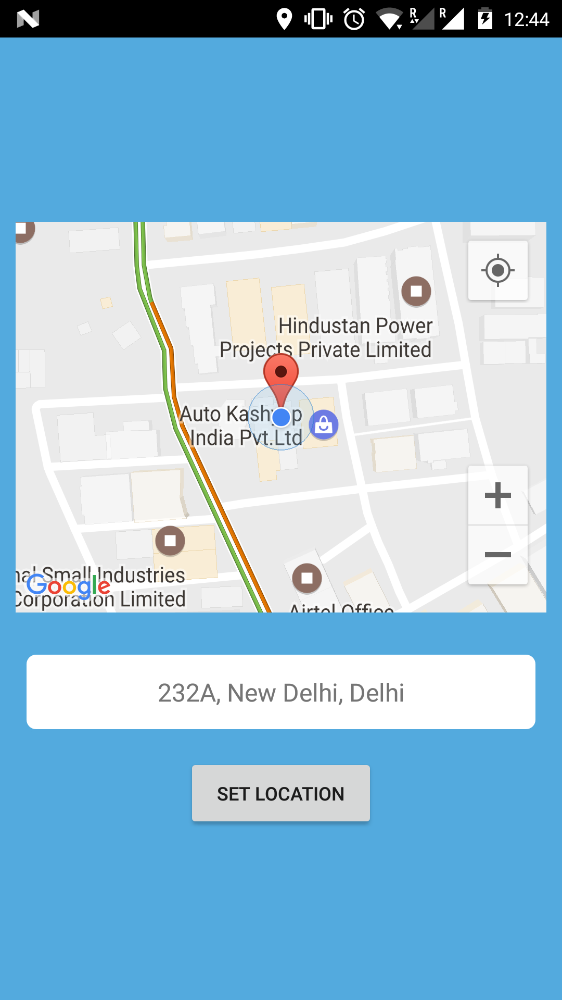
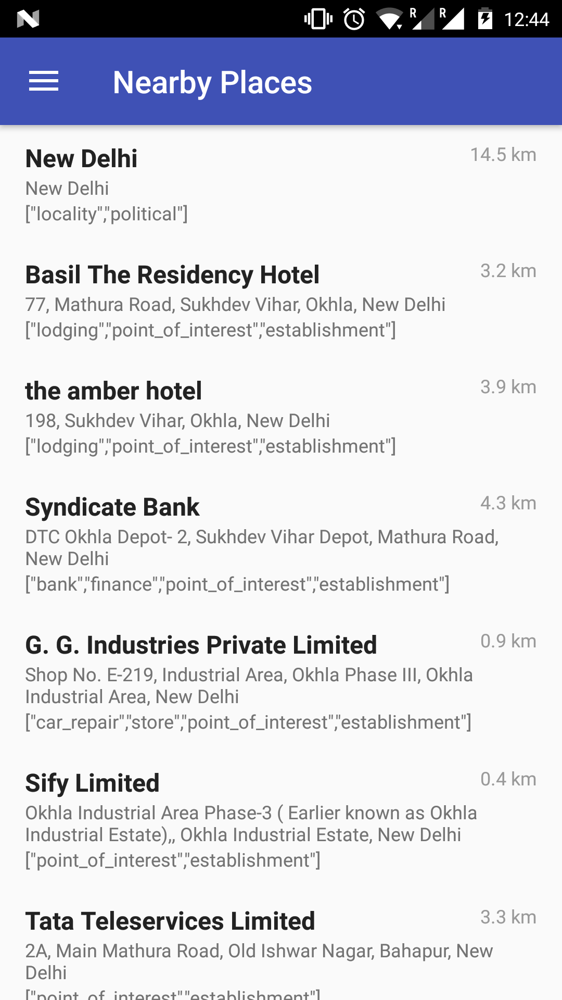
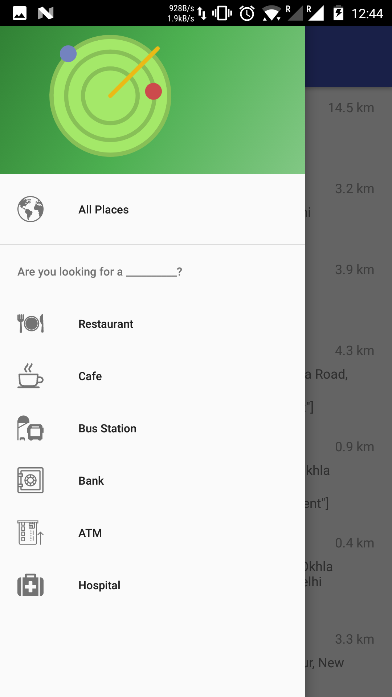
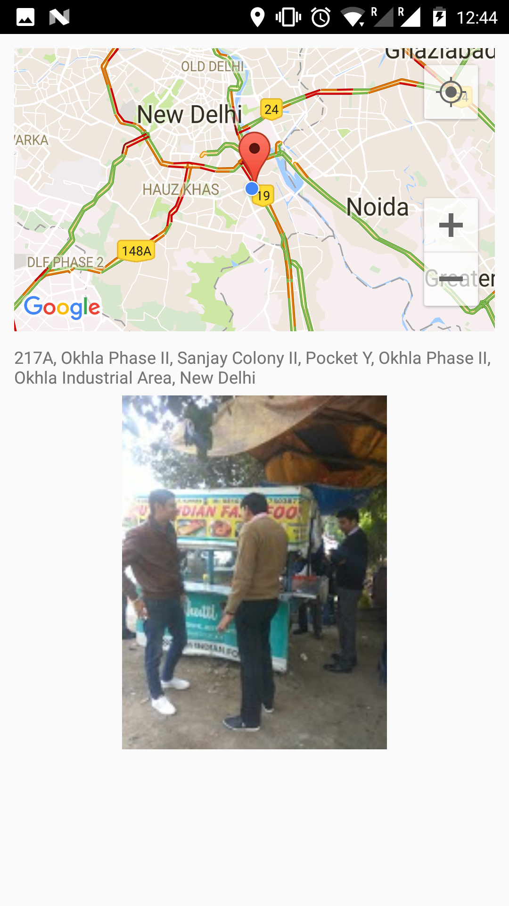

# Nearby Places
An android application which implements Google Places API with Google Maps Distance Matrix API and produces a list of all nearby places.

**This is the base of the actual application. No UI modifications has been done.**

# Preview
Setting the Location             |  All Nearby Places
:-------------------------:|:-------------------------:
  |  

Specific Places             |  Details About the Place
:-------------------------:|:-------------------------:
  |  
